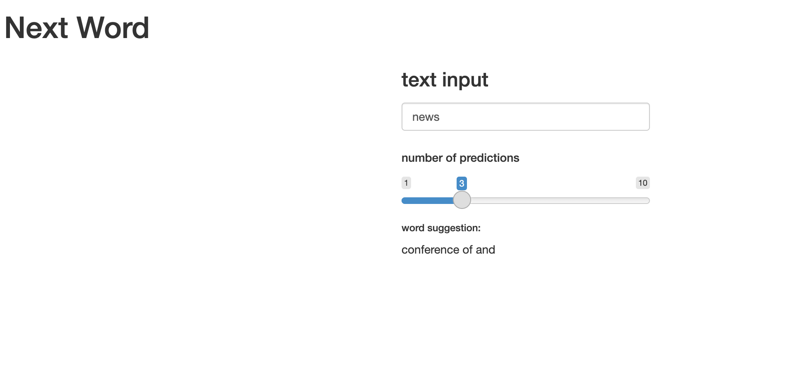

```{r setup, include=FALSE}
knitr::opts_chunk$set(echo = FALSE)
```

## Prediction Algorithm

The predictive model consists of generating the k most probable words following 
a text entry. Based on calculating the conditional probability of a word $w$ 
given some history $h$, $$P(w,h).$$

The performance of the model varies for different choices of the "minFrequency"
parameter, which sets the minimum count of n-grams that are included in the
probability calculation.


## Next word design

```{r, echo = FALSE, out.width="100%"}

```

## Algorithm

```{r, echo=FALSE}
DiagrammeR::grViz("digraph {
  graph [layout = dot, rankdir = LR]
  
  node [shape = circle, style = filled, 
  fillcolor = azure2, fontsize = 18, width = 1.3]        
  rec1 [label = 'Process CORPUS data']
  rec2 [label = 'Training set']
  rec3 [label = 'Test set']
  rec4 [label = 'Store count of n-grams']
  rec5 [label = 'Determine conditional probability \n of a given n-gram']
  rec6 [label = 'Evaluate the model']
  
  # edge definitions with the node IDs
  rec1 -> {rec2 rec3}
  rec2 -> rec4 -> rec5
  rec3 -> rec6
  
  }",
  height = 500)
```

## Test the app

### shiny app can be found at 
<https://sariaslaso.shinyapps.io/shiny_app/>

### source code
<https://github.com/sariaslaso/data-science-capstone>


